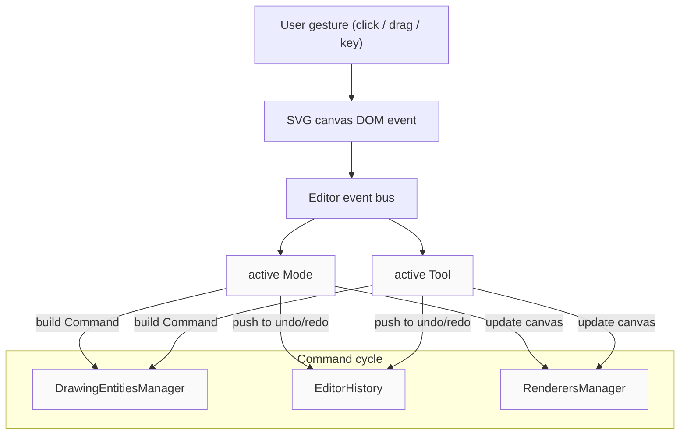
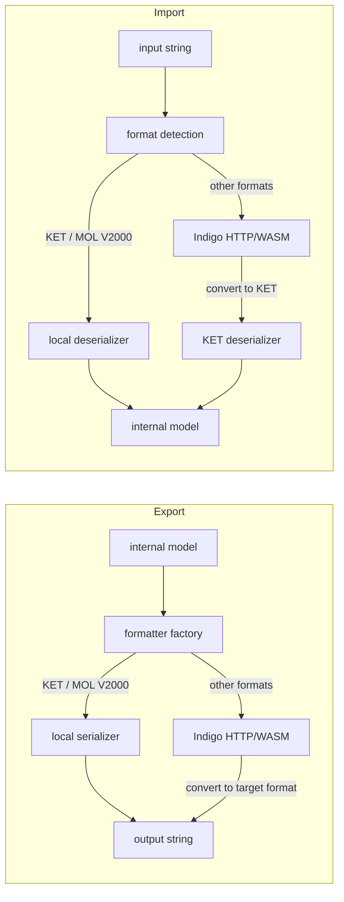

# Architecture

> How is the system organized?

## Overview

Ketcher is a web-based chemical structure editor built as a TypeScript/React monorepo (npm workspaces). It supports two editing domains:

- **Micromolecules mode** — classic 2D small-molecule/reaction editor (atoms, bonds, SGroups, R-Groups, etc.)
- **Macromolecules mode** — polymer/sequence editor for peptides, RNA, DNA, and CHEM monomers

The two modes coexist in the same browser tab. Switching between them is controlled via the `ModeControl` toggle component or ketcher api. Each mode has its own editor instance, renderer, and state management, but they share a single `Ketcher` facade and the `ketcher-core` domain/application layer.

---

## Package Structure

| Package                            | Purpose                                                 |
| ---------------------------------- | ------------------------------------------------------- |
| `packages/ketcher-core/`           | Domain model, application logic, serializers, renderers |
| `packages/ketcher-react/`          | React UI for micromolecules editor (small molecules)    |
| `packages/ketcher-macromolecules/` | React UI for macromolecules editor (polymers)           |
| `packages/ketcher-standalone/`     | Standalone bundle: Indigo WASM + ketcher-core glue      |

## Subsystems

### 1. `ketcher-core`

The shared foundation that both UI packages build on. It owns the entire domain model (atoms, bonds, monomers, chains), both rendering pipelines, all serializers and format converters, the editor and history machinery, and the Indigo service abstraction — everything that is not React UI.

| Path                                              | Purpose                                                                 |
| ------------------------------------------------- | ----------------------------------------------------------------------- |
| `ketcher-core/src/application/editor/`            | CoreEditor, EditorHistory, tools, operations, modes                     |
| `ketcher-core/src/application/render/`            | Raphael (micro) & D3/SVG (macro) renderers                              |
| `ketcher-core/src/application/formatters/`        | Read/write molecule data in various formats                             |
| `ketcher-core/src/application/indigo.ts`          | Thin wrapper over StructService (chemistry backend)                     |
| `ketcher-core/src/application/ketcher.ts`         | Public Ketcher facade (API surface)                                     |
| `ketcher-core/src/application/ketcherBuilder.ts`  | Builder for constructing Ketcher instances                              |
| `ketcher-core/src/application/ketcherProvider.ts` | Registry: at most one Ketcher instance per ketcherId                    |
| `ketcher-core/src/domain/entities/`               | Struct, Atom, Bond, BaseMonomer, PolymerBond, DrawingEntitiesManager, … |
| `ketcher-core/src/domain/serializers/`            | KET, MOL, SDF serializers                                               |
| `ketcher-core/src/domain/services/`               | StructService interface, StructServiceProvider                          |
| `ketcher-core/src/domain/constants/`              | Elements, monomers, layout constants                                    |
| `ketcher-core/src/domain/helpers/`                | Pure helpers (monomers, rna, attachmentPoints, …)                       |
| `ketcher-core/src/infrastructure/`                | StructService HTTP implementations (remote mode)                        |
| `ketcher-core/src/utilities/`                     | KetcherLogger, SettingsManager, clipboard, SVG utils                    |
| `ketcher-core/src/types/`                         | Shared TypeScript type declarations                                     |

### 2. `ketcher-react`

- React wrapper around the micromolecules (Raphael-based) editor
- `Editor.tsx` — top-level component
- `MicromoleculesEditor.tsx` — mounts the Raphael canvas and Redux store
- `script/editor/Editor.ts` — editor instance (wraps Raphael render + tool system)
- `script/ui/` — all React UI: toolbars, dialogs, state (Redux), hotkeys

### 3. `ketcher-macromolecules`

- React + Redux Toolkit + MUI
- `Editor.tsx` — creates `CoreEditor`, owns the D3/SVG canvas, mounts Redux store
- `state/common/editorSlice.ts` — primary Redux slice (editor instance, layout mode, tools, preview, line-length)
- `components/` — MonomerLibrary, ContextMenu, TopMenu, LeftMenu, ZoomControls, Ruler, Modals, etc.

### 4. `ketcher-standalone`

- Bundles Indigo WASM and registers a `StandaloneStructService` as `StructService`
- Allows Ketcher to run entirely in the browser with no self-hosted backend
- Entry: `src/index.ts` / `src/infrastructure/services/`

---

## Key Interactions

**Event flow** — see [editor-engine deep-dive](./modules/editor-engine.md) for full details.

When the user interacts with the canvas (click, drag, key press), the editor captures the raw DOM event and forwards it through its event bus to the active mode and the active tool. The tool is responsible for deciding what should happen: it validates and interprets the event data, asks the drawing-entities manager to build a Command (a grouped set of reversible operations), then hands that Command to the history (so the action can be undone) and to the renderers manager (so the canvas updates to reflect the change).

```mermaid
flowchart TD
    A["User gesture (click / drag / key)"] --> B[SVG canvas DOM event]
    B --> C[Editor event bus]
    C --> D[active Mode]
    C --> E[active Tool]

    subgraph command-cycle["Command cycle"]
        F[DrawingEntitiesManager]
        G[EditorHistory]
        H[RenderersManager]
    end

    D -->|"build Command"| F
    D -->|"push to undo/redo"| G
    D -->|"update canvas"| H
    E -->|"build Command"| F
    E -->|"push to undo/redo"| G
    E -->|"update canvas"| H

    D:::note
    E:::note
    F:::note
    G:::note
    H:::note

    classDef note fill:#fafafa
```

- **active Tool** — interprets the event, validates, calculates
- **DrawingEntitiesManager** — builds a Command (grouped reversible operations)
- **EditorHistory** — pushes Command to undo/redo stack
- **RenderersManager** — executes Command, updates SVG canvas

**Format conversion flow** — see [serialization deep-dive](./modules/serialization.md) for full details, and [formats/ket-1.0-specification.md](./formats/ket-1.0-specification.md) / [formats/ket-2.0-specification.md](./formats/ket-2.0-specification.md) for the full KET JSON schema.

When the user exports or imports a structure, the formatter factory picks the right strategy based on the requested format. KET and MOL V2000 are handled by Ketcher itself. Every other format (SMILES, InChI, HELM, FASTA, and so on) is routed through Indigo — either a remote server or the embedded WASM build. In that case the model is first serialized to KET (the universal interchange format), sent to Indigo for conversion, and the result is returned. Import is the mirror: non-local formats are sent to Indigo, which returns KET, and KET is then deserialized into the internal model.

```mermaid
flowchart LR
    subgraph Export
        IM[internal model] --> FF1[formatter factory]
        FF1 -->|KET / MOL V2000| LS[local serializer]
        FF1 -->|other formats| IND1[Indigo HTTP/WASM]
        LS --> OS1[output string]
        IND1 -->|convert to target format| OS1
    end

    subgraph Import
        IS[input string] --> FD[format detection]
        FD -->|KET / MOL V2000| LD[local deserializer]
        FD -->|other formats| IND2[Indigo HTTP/WASM]
        IND2 -->|convert to KET| KD[KET deserializer]
        LD --> MDL[internal model]
        KD --> MDL
    end
```

---

## Build & Toolchain

> Migration in progress. See [ADR 2026-08-28 — Vite for library builds](./adr/2026-08-28-vite-for-library-builds.md) for the decision and its rationale.

The repository is an npm-workspaces monorepo with no additional monorepo tool (no Lerna, Nx, or
Turbo). Cross-package orchestration is plain npm scripts sequenced with `npm-run-all2`.

**Toolchain: Vite 8 (Rolldown), except where noted below.** Two targets are excluded by design —
`example-ssr` builds with Next.js, and `ketcher-autotests` has no bundler. `ketcher-standalone`
may remain on Rollup 2 permanently if its web-worker output cannot be reproduced; if you find a
Rollup config in this repo, check the ADR before assuming it is unfinished work.

| Target                            | Kind    | Builder                                             |
| --------------------------------- | ------- | --------------------------------------------------- |
| `packages/ketcher-core`           | library | Vite 8, per-file output (`preserveModules`)         |
| `packages/ketcher-react`          | library | Vite 8, dual ESM/CJS, extracted CSS                 |
| `packages/ketcher-macromolecules` | library | Vite 8, single-file dual output, extracted CSS      |
| `packages/ketcher-standalone`     | library | six build variants — **stays on Rollup 2**, see ADR |
| `example`                         | app     | Vite 8                                              |
| `demo`                            | app     | Vite 8                                              |
| `example-ssr`                     | app     | Next.js — not a Vite target                         |

### Invariants

**The published contract is frozen.** Package file names, output formats, and
`main`/`module`/`types`/`exports` entries do not change as a result of build tooling work.
Some of that metadata is known to be wrong (see the ADR) and is preserved deliberately.

**Type declarations are emitted by TypeScript, not the bundler.** Each package runs
`tsc --emitDeclarationOnly`, plus `tsc-alias` where path aliases are used.

**Build configuration is shared from the root, never reached for across packages.** Constants
common to several builds live in the root `build-config/` directory (not `build/` — `.gitignore`
has a bare `build` pattern that would silently ignore it). A package's build config must not be
imported by another package, and no build may read another package's `dist/` output.

### Verification

`example` aliases the four packages to their **source**, so it never exercises the published
`dist/` output. `example-ssr` resolves them through their `exports` maps as a real consumer, and
is therefore the only check that the published contract, the CJS `require` conditions, and
SSR-safety hold. A build tooling change is verified by: build → diff `dist/` against the previous
baseline → `example-ssr` builds and renders → Playwright suite green.
