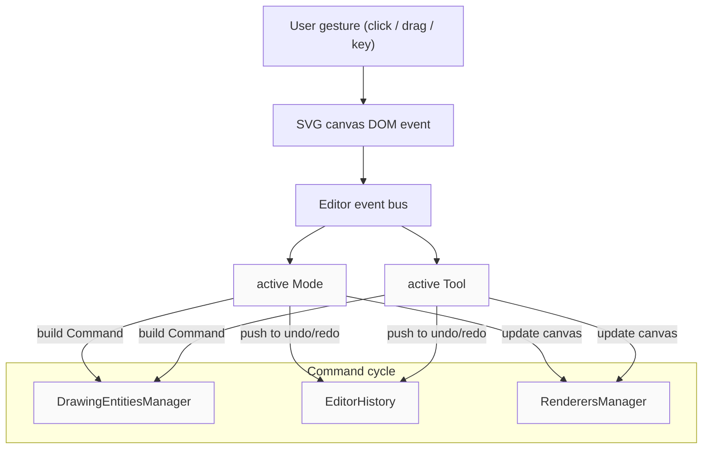
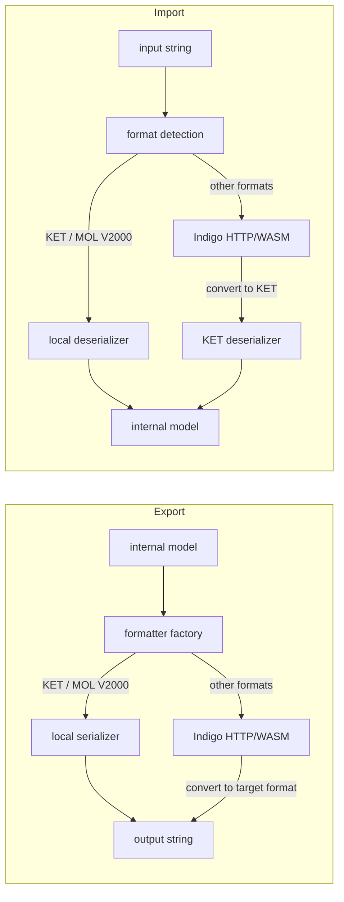

# Architecture

> How is the system organized?

## Overview

Ketcher is a web-based chemical structure editor built as a TypeScript/React monorepo (npm workspaces). It supports two editing domains:

- **Micromolecules mode** — classic 2D small-molecule/reaction editor (atoms, bonds, SGroups, R-Groups, etc.)
- **Macromolecules mode** — polymer/sequence editor for peptides, RNA, DNA, and CHEM monomers

When macromolecules editing is enabled, the two modes coexist in the same browser tab. Switching
between them is controlled via the `ModeControl` toggle component or Ketcher API. Each mode has its
own editor instance, renderer, and state management, but they share a single `Ketcher` facade and
the `ketcher-core` domain/application layer. Integrators may opt out; then the lazily loaded
macromolecules package is not requested, no macromolecules core editor is created, and APIs or UI
that require it handle its absence safely.

---

## Package Structure

| Package                            | Purpose                                                 |
| ---------------------------------- | ------------------------------------------------------- |
| `packages/ketcher-core/`           | Domain model, application logic, serializers, renderers |
| `packages/ketcher-react/`          | React UI for micromolecules editor (small molecules)    |
| `packages/ketcher-macromolecules/` | React UI for macromolecules editor (polymers)           |
| `packages/ketcher-standalone/`     | Standalone bundle: Indigo WASM + ketcher-core glue      |

## Subsystems

### 1. `ketcher-core`

The shared foundation that both UI packages build on. It owns the entire domain model (atoms, bonds, monomers, chains), both rendering pipelines, all serializers and format converters, the editor and history machinery, and the Indigo service abstraction — everything that is not React UI.

| Path                                              | Purpose                                                                 |
| ------------------------------------------------- | ----------------------------------------------------------------------- |
| `ketcher-core/src/application/editor/`            | CoreEditor, EditorHistory, tools, operations, modes                     |
| `ketcher-core/src/application/render/`            | Raphael (micro) & D3/SVG (macro) renderers                              |
| `ketcher-core/src/application/formatters/`        | Read/write molecule data in various formats                             |
| `ketcher-core/src/application/indigo.ts`          | Thin wrapper over StructService (chemistry backend)                     |
| `ketcher-core/src/application/ketcher.ts`         | Public Ketcher facade (API surface)                                     |
| `ketcher-core/src/application/ketcherBuilder.ts`  | Builder for constructing Ketcher instances                              |
| `ketcher-core/src/application/ketcherProvider.ts` | Registry: at most one Ketcher instance per ketcherId                    |
| `ketcher-core/src/domain/entities/`               | Struct, Atom, Bond, BaseMonomer, PolymerBond, DrawingEntitiesManager, … |
| `ketcher-core/src/domain/serializers/`            | KET, MOL, SDF serializers                                               |
| `ketcher-core/src/domain/services/`               | StructService interface, StructServiceProvider                          |
| `ketcher-core/src/domain/constants/`              | Elements, monomers, layout constants                                    |
| `ketcher-core/src/domain/helpers/`                | Pure helpers (monomers, rna, attachmentPoints, …)                       |
| `ketcher-core/src/infrastructure/`                | StructService HTTP implementations (remote mode)                        |
| `ketcher-core/src/utilities/`                     | KetcherLogger, SettingsManager, clipboard, SVG utils                    |
| `ketcher-core/src/types/`                         | Shared TypeScript type declarations                                     |

### 2. `ketcher-react`

- React wrapper around the micromolecules (Raphael-based) editor
- `Editor.tsx` — top-level component
- `MicromoleculesEditor.tsx` — mounts the Raphael canvas and Redux store
- `script/editor/Editor.ts` — editor instance (wraps Raphael render + tool system)
- `script/ui/` — all React UI: toolbars, dialogs, state (Redux), hotkeys
- `src/i18n/` — `react-i18next` UI-text localization (English + Simplified Chinese today); see [modules/i18n.md](./modules/i18n.md). The shared `i18next` instance lives here and also serves `ketcher-macromolecules` (see below) — both packages' UI translate together as one unit.

### 3. `ketcher-macromolecules`

- React + Redux Toolkit + MUI
- `Editor.tsx` — creates `CoreEditor`, owns the D3/SVG canvas, mounts Redux store
- `state/common/editorSlice.ts` — primary Redux slice (editor instance, layout mode, tools, preview, line-length)
- `components/` — MonomerLibrary, ContextMenu, TopMenu, LeftMenu, ZoomControls, Ruler, Modals, etc.
- Own translation namespaces (`macromolecules`, `macromoleculesDialogs`) registered into `ketcher-react`'s shared `i18next` instance at runtime — see [modules/i18n.md](./modules/i18n.md).
- **Dependency on `ketcher-react`:** `ketcher-react/src/Editor.tsx` lazily imports this package (`import('ketcher-macromolecules')`). `ketcher-macromolecules` is declared as a regular dependency in `ketcher-react/package.json`, so `rollup-plugin-peer-deps-external` externalizes the import — `ketcher-react`'s build never inlines a snapshot of this package, it leaves the dynamic import for the final consumer to resolve. Because of this, `build:packages`' build order between the two is no longer load-bearing for staleness (`core → (standalone ‖ react) → macromolecules`); verified by injecting a unique marker string into this package's source and confirming it never appears in `ketcher-react`'s bundle output regardless of build order.

### 4. `ketcher-standalone`

- Bundles Indigo WASM and registers a `StandaloneStructService` as `StructService`
- Allows Ketcher to run entirely in the browser with no self-hosted backend
- Entry: `src/index.ts` / `src/infrastructure/services/`

---

## Key Interactions

**Event flow** — see [editor-engine deep-dive](./modules/editor-engine.md) for full details.

When the user interacts with the canvas (click, drag, key press), the editor captures the raw DOM event and forwards it through its event bus to the active mode and the active tool. The tool is responsible for deciding what should happen: it validates and interprets the event data, asks the drawing-entities manager to build a Command (a grouped set of reversible operations), then hands that Command to the history (so the action can be undone) and to the renderers manager (so the canvas updates to reflect the change).

```mermaid
flowchart TD
    A["User gesture (click / drag / key)"] --> B[SVG canvas DOM event]
    B --> C[Editor event bus]
    C --> D[active Mode]
    C --> E[active Tool]

    subgraph command-cycle["Command cycle"]
        F[DrawingEntitiesManager]
        G[EditorHistory]
        H[RenderersManager]
    end

    D -->|"build Command"| F
    D -->|"push to undo/redo"| G
    D -->|"update canvas"| H
    E -->|"build Command"| F
    E -->|"push to undo/redo"| G
    E -->|"update canvas"| H

    D:::note
    E:::note
    F:::note
    G:::note
    H:::note

    classDef note fill:#fafafa
```

- **active Tool** — interprets the event, validates, calculates
- **DrawingEntitiesManager** — builds a Command (grouped reversible operations)
- **EditorHistory** — pushes Command to undo/redo stack
- **RenderersManager** — executes Command, updates SVG canvas

**Format conversion flow** — see [serialization deep-dive](./modules/serialization.md) for full details, and [formats/ket-1.0-specification.md](./formats/ket-1.0-specification.md) / [formats/ket-2.0-specification.md](./formats/ket-2.0-specification.md) for the full KET JSON schema.

When the user exports or imports a structure, the formatter factory picks the right strategy based on the requested format. KET and MOL V2000 are handled by Ketcher itself. Every other format (SMILES, InChI, HELM, FASTA, and so on) is routed through Indigo — either a remote server or the embedded WASM build. In that case the model is first serialized to KET (the universal interchange format), sent to Indigo for conversion, and the result is returned. Import is the mirror: non-local formats are sent to Indigo, which returns KET, and KET is then deserialized into the internal model.

```mermaid
flowchart LR
    subgraph Export
        IM[internal model] --> FF1[formatter factory]
        FF1 -->|KET / MOL V2000| LS[local serializer]
        FF1 -->|other formats| IND1[Indigo HTTP/WASM]
        LS --> OS1[output string]
        IND1 -->|convert to target format| OS1
    end

    subgraph Import
        IS[input string] --> FD[format detection]
        FD -->|KET / MOL V2000| LD[local deserializer]
        FD -->|other formats| IND2[Indigo HTTP/WASM]
        IND2 -->|convert to KET| KD[KET deserializer]
        LD --> MDL[internal model]
        KD --> MDL
    end
```

---

## Build & Toolchain

> See [ADR 2026-08-28 — Vite for library builds](./adr/2026-08-28-vite-for-library-builds.md) for the migration rationale and [ADR 2026-09-29 — Vite output stability policy](./adr/2026-09-29-vite-output-stability-policy.md) for the current browser and published-output contract.

The repository is an npm-workspaces monorepo with no additional monorepo tool (no Lerna, Nx, or
Turbo). Cross-package orchestration is plain npm scripts sequenced with `npm-run-all2`.

**Toolchain: Vite 8 (Rolldown), except where noted below.** Two targets are excluded by design —
`example-ssr` builds with Next.js, and `ketcher-autotests` has no bundler. No Rollup config
remains in the repository.

| Target                            | Kind    | Builder                                        |
| --------------------------------- | ------- | ---------------------------------------------- |
| `packages/ketcher-core`           | library | Vite 8, per-file output (`preserveModules`)    |
| `packages/ketcher-react`          | library | Vite 8, dual ESM/CJS, extracted CSS            |
| `packages/ketcher-macromolecules` | library | Vite 8, single-file dual output, extracted CSS |
| `packages/ketcher-standalone`     | library | Vite 8, six build variants over one config     |
| `example`                         | app     | Vite 8                                         |
| `demo`                            | app     | Vite 8                                         |
| `example-ssr`                     | app     | Next.js — not a Vite target                    |

### Invariants

**Published outputs are stable by default.** Ordinary build-tool changes preserve package file
names, output formats, and JavaScript `import`/`require` mappings. Intentional correctness changes
are documented exceptions: #11993 removed invalid `require` conditions from the standalone
`binaryWasm` and `binaryWasmNoRender` subpaths, and #11999 replaced hashed worker/`.wasm` asset
names with fixed names. #11992 also exposes existing declarations through `types` conditions and
adds `./package.json` exports to the affected maps. See the follow-up Vite ADR for the policy and
its complete rationale.

**Type declarations are emitted by TypeScript, not the bundler.** Each package runs
`tsc --emitDeclarationOnly`, plus `tsc-alias` where path aliases are used.

**Build configuration is shared from the root, never reached for across packages.** Constants
common to several builds live in the root `build-config/` directory (not `build/` — `.gitignore`
has a bare `build` pattern that would silently ignore it). A package's build config must not be
imported by another package, and no build may read another package's `dist/` output.

### Verification

`example` aliases the four packages to their **source**, so it never exercises the published
`dist/` output. `example-ssr` resolves package outputs through their `exports` maps and exercises
runtime entrypoints and SSR safety. CI also runs `npm run check:package-metadata` after the build;
it packs all four publishable packages and checks their metadata and declaration resolutions with
publint and Are The Types Wrong.

`example`/`example-ssr` still don't cover `ketcher-standalone`'s `binaryWasm`/`binaryWasmNoRender`
build variants against a real external bundler: `example` only ever uses the default inline
build. `scripts/check-standalone-consumer.mjs` closes that gap and runs in CI after the metadata
check. It `npm pack`s `ketcher-core` and `ketcher-standalone`, installs the tarballs into separate
Vite and webpack 5 consumer projects in an OS temporary directory outside the repository, and
asserts that each consumer emits a distinct worker file and matching `.wasm` asset for both
variants. Keeping the consumers outside the repository prevents Node and npm from falling back
to workspace links or local `dist/` output and masking undeclared package dependencies.
