**Ketcher** is a tool to draw molecular structures and chemical
reactions.

# Ketcher Overview

**Ketcher** is a tool to draw molecular structures and chemical
reactions. The application operates in two modes - Standalone and Remote:

- Standalone mode is based on WASM and can be run as client-only application without a backend.

- Remote version requires Indigo Service as a backend server to perform complex calculations (When the server is not responding you can continue to work in the application although some of the functions will be unavailable).

**Ketcher** consists of the following elements:

**Note** : Depending on the screen size, some tools on the _Tool
palette_ can be displayed in expanded or collapsed forms.

Using the _Tool palette_, you can

- draw and edit a molecule or reaction by clicking on and dragging
  atoms, bonds, and other elements provided with the buttons on the
  _Atoms_ toolbar and _Tool palette_;

- delete any element of the drawing (atom or bond) by clicking on it
  with the Erase tool;

- delete the entire molecule or its fragment using the lasso,
  rectangle, or fragment selection and the Erase tool;

- draw special structures (see the following sections);

- select the entire molecule or its fragment in one of the following
  ways (click on the button  to see the list of available options):

   

To select **one atom or bond**, click Lasso (1) or Rectangle Selection tool (2),
and then click the atom or bond.

To select the **entire structure**:

- Select the Fragment Selection tool (3) and then click the object.

- Select the Lasso or Rectangle Selection tool, and then drag the
  mouse to select the object.

- `Ctrl-click` with the Lasso or Rectangle Selection tool.

To select **multiple atoms, bonds, structures, or other objects**, do one
of the following:

- `Shift-click` with the Lasso or Rectangle Selection tool selects
  some (connected or not) atoms/bonds.

- With the Lasso or Rectangle Selection tool click and drag the
  mouse around the atoms, bonds, or structures that you want to
  select.

**Note** : `Ctrl+Shift-click each structure` with the Lasso or Rectangle Selection tool
selects several structures.

You can use the buttons of the _Main_ toolbar:

 

- **Clear Canvas** (1) button to start drawing a new molecule; this
  command clears the drawing area;

- **Open…** (2) and **Save As…** (3) buttons to import a molecule
  from a molecular file or save it to a supported molecular file
  format;

-  **Copy** with additional abilties to **Copy As** (4), **Paste** (5), **Cut** (6) buttons to perform
  the corresponding actions;
  
- **Undo** (7) / **Redo** (8) to manage the last actions taken on the canvas; 
 
- **Aromatize** (9) / **Dearomatize** (10) buttons to mark aromatic
  structures (to convert a structure to the Aromatic or Kekule
  presentation);
  
- **Layout** button (11) to change the position of the structure to
  work with it with the most convenience;

- **Clean Up** button (12) to improve the appearance of the
  structure by assigning them uniform bond lengths and angles.

- **Calculate CIP** button (13) to determine R/S and E/Z
  configurations;

- **Check Structure** button (14) to check the following properties  of the structure. 
  Check will be conducted immediately when the operation is selected. 
  You can check only the Settings you are interested in and check structure again with new settings by clicking on Check button. 
  Apply button will save the Settings checked and they will be applied for the file saving. 

   

- **Calculated Values** button (15) to display some properties of
  the structure:

   
  
- **Stereochemistry** button (16) to assign and display enhanced stereochemistry properties of the structure

- **3D Viewer** button (17) to open the structure in the
  three-dimensional Viewer;

- **Settings** button (18) to make some settings for molecular
  files:

    

- **Help** button (19) to view Help;

- **About** button (20) to display version and copyright information
  of the program.
  
- **Fullscreen mode** button (21) allows to initiate displaying Ketcher window in the fullscreen mode.
  
- **Zoom panel** (22) displays the current zoom percentage. Click to expand the Zoom panel and use the following actions: **Zoom percentage** (23) to set the view manually, **Zoom in** (24) / **Zoom out** (25) to scale the view gradually, **Zoom 100%**  (26) to enable the default zoom setting. 

     
   

# 3D Viewer

The structure appears in a modal window after clicking on the **3D
Viewer** button  on the top panel:

 

You can perform the following actions:

- Rotate the structure holding the left mouse button;

- Zoom In/Out the structure;

Ketcher Settings allow to change the appearance of the structure and background coloring on the 3D Viewer tab.

"Lines" drawing method, "Bright" atom name coloring
method and "Light" background coloring are default.

# Drawing Atoms

To draw/edit atoms you can:

- select an atom in the Atoms toolbar and click inside the drawing
  area;

- if the desired atom is absent in the toolbar, click on
  the  button to invoke the Periodic Table and
  click on the desired atom (available options: _Single_ – selection
  of a single atom, _List_ – choose an atom from the list of selected
  options (To allow one atom from a list of atoms of your choice at
  that position), _Not List_ - exclude any atom on your list at that
  position).

  

- add an atom to the existing molecule by selecting an atom in the
  _Atoms_ toolbar, clicking on an atom in the molecule, and dragging
  the cursor; the atom will be added with a single bond; vacant
  valences will be filled with the corresponding number of hydrogen
  atoms;

- change an atom by selecting an atom in the _Atoms_ toolbar and
  clicking on the atom to be changed; in the case a wrong valence
  appears the atom will be underlined in red;

- change an atom by clicking on an existing atom with the
  _Selection_ tool and starting to enter text after that; type another atom symbol in the text box:
  
   
  
- change the charge of an atom by selecting the Charge Plus or
  Charge Minus tool and clicking consecutively on an atom to
  increase/decrease its charge:

   

- change an atom or its properties by double-clicking on the atom to
  invoke the Atom Properties dialog (the dialog also provides atom
  query features):

   

- click on the  button to use the Extended table and
  select a corresponding Generic group or Special Node:

   

# Drawing Bonds

To draw/edit bonds you can:

- Click an arrow on the Bond tool  in the Tool palette
  to open the drop-down list with the following bond types:

    
    
  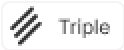    
    
  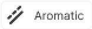  
  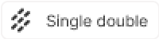  
  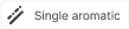   
  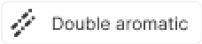    
    
      
    
  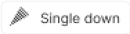  
  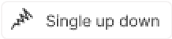  
    
 
    
- select a bond type from the drop down list and click inside the
  drawing area; a bond of the selected type will be drawn;

- click on an atom in the molecule; a bond of the selected type will
  be added to the atom at the angle of 120 degrees;

- add a bond to the existing molecule by clicking on an atom in the
  molecule and dragging the cursor; in this case you can set the angle
  manually;

- change the bond type by clicking on it;

- use the Chain Tool  to draw consecutive single
  bonds;

- change a bond or its properties by double-clicking on the bond to
  invoke the Bond Properties dialog:

- clicking on the drawn stereo and dative bonds change their direction.

- clicking with the Single Bond tool or Chain tool switches the bond type
  cyclically: Single-Double-Triple-Single.

# Drawing R-Groups

Use the _R-Group_ toolbox  to draw R-groups in Markush
structures:

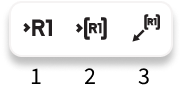 

Selecting the _R-Group_ _Label_ Tool (1) and clicking on an atom in the
structure invokes the dialog to select the R-Group label for a current
atom position in the structure:

 

Selecting the R-Group label and clicking **OK** converts the structure
into a Markush structure with the selected R-Group label:

 

**Note** : You can choose several R-Group labels simultaneously:

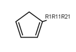   

Particular chemical fragments that may be substituted for a given
R-Group form a set of R-Group members. R-Group members can be any
structural fragment, including functional groups and single atoms or
atom lists.

To create a set of R-Group members:

1. Draw a structure to become an R-Group member.

2. Select the structure using the *R-Group Fragment Tool* (2) to invoke
   the R-Group dialog; in this dialog select the label of the
   R-Group to assign the fragment to.

3. Click on **Apply** to convert the structure into an R-Group member.

An R-Group attachment point is the atom in an R-Group member fragment
that attaches the fragment to the initial Markush structure.

Selecting the _Attachment Point Tool_ (3) and clicking on an atom in the
R-Group fragment converts this atom into an attachment point. If the
R-Group contains more than one attachment point, you can specify one
of them as primary and the other as secondary. You can select between
either the primary or secondary attachment point using the dialog that
appears after clicking on the atom:

  

If there are two attachment points on an R-Group member, there must be
two corresponding attachments (bonds) to the R-Group atom that has the
same R-Group label. Clicking on **Apply** in the above dialog creates the
attachment point.

Schematically, the entire process of the R-Group member creation can
be presented as:

 

 

# R-Group Logic

**Ketcher** enables one to add logic when using R-Groups. To access
the R-Group logic:

1. Create an R-Group member fragment as described above.

2. Move the cursor over the entire fragment for the green frame to
   appear, then click inside the fragment. The following dialog
   appears:

     

3. Specify **Occurrence** to define how many of an R-Group
   occurs. If an R-Group atom appears several times in the initial
   structure, you will specify **Occurrence**"&gt;n", n
   being the number of occurrences; if it appears once, you see
   "R1 > 0".

4. Specify H at **unoccupied** R-Group sites ( **RestH** ): check or
   clear the checkbox.

5. Specify the logical **Condition**. Use the R-Group condition **If
   R(i) Then** to specify whether the presence of an R-Group is
   dependent on the presence of another R-Group.

# Marking S-Groups

To mark S-Groups, use the _S-Group tool_  and the
following dialog that appears after selecting a fragment with this
tool:

     

Available S-Group types:

_Generic_

Generic is a pair of brackets without any labels.

_Multiple group_

A Multiple group indicates a number of replications of a fragment or a part of a
structure in contracted form.

_SRU Polymer_

The Structural Repeating Unit (SRU) brackets enclose the structural
repeating of a polymer. You have three available patterns:
head-to-tail (the default), head-to-head, and either/unknown.

_Superatom_

An abbreviated structure (abbreviation) is all or part of a structure
(molecule or reaction component) that has been abbreviated to a text
label. Structures that you abbreviate keep their chemical
significance, but their underlying structure is hidden. The current
version can&#39;t display contracted structures but correctly
saves/reads them into/from files.

# Data S-Groups

The _Data S-Groups Tool_  is a separate tool for
comfortable use with the accustomed set of descriptors (like Attached
Data in **Marvin** Editor).

You can attach data to an atom, a fragment, a multifragment, a single bond, or a
group. The defined set of _Names_ and _Values_ is introduced for each
type of selected elements:

 

- Select the appropriate S-Group Field Name.

- Select the appropriate Field Value.

- Labels can be specified as Absolute, Relative or Attached.

# Changing Structure Display

Use the _Rotate_ tool  to change the structure
display:

 

_Rotate Tool_ (1)

This tool allows rotating objects.

- If some objects are selected, the tool rotates the selected objects.
- If no objects are selected, or all objects are selected, the tool rotates the whole canvas
- The default rotation step is 15 degrees.
- Press and hold the Ctrl key for more gradual continuous rotation with 1 degree rotation step

Select any bond on the structure and click Alt+H to rotate the structure so that the selected bond is placed horizontally.
Select any bond on the structure and click Alt+V to rotate the structure so that the selected bond is placed vertically.

_Flip Tool_ (2, 3)

This tool flips the objects horizontally or vertically.

- If some objects are selected, the Horizontal Flip tool (or Alt+H) flips the selected objects horizontally
- If no objects are selected, or all objects are selected, the Horizontal Flip tool (or Alt+H) flips each structure horizontally
- If some objects are selected, the Vertical Flip tool (or Alt+V) flips the selected objects vertically
- If no objects are selected, or all objects are selected, the Vertical Flip tool (or Alt+V) flips each structure vertically

# Drawing Reactions

To draw/edit reactions you can:

- draw reagents and products as described above;
- use options of the _Reaction Arrow Tool_  to draw an
  arrow. Select the arrow needed from the list 
- draw pluses in the reaction equation using the _Reaction Plus Tool_ 
- map same atoms in reagents and products with the _Reaction Mapping Tools_ . Explore the available reaction mapping tools below:

  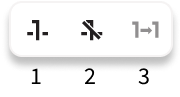 

1 – Reaction Auto-Mapping Tool

2 – Reaction Mapping Tool

3 – Reaction Unmapping Tool

# Drawing graphical objects

To draw graphical objects click the arrow on the *Shape Ellipse* tool   in the Tools palette
to open the drop-down list with the following tools:

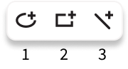 

 *Shape Ellipse* (1), *Shape Rectangle* (2), and *Shape Line* (3). 

# Creating text objects on the canvas

To add text to the canvas click the *Add text* tool  
in the Tools palette and click the canvas to open the Text editor window:

 

- To enter text, type in the Text editor field.
- To edit text, double click the text object on the canvas.
- Change the text style to bold and italic, make it subscript and superscript while typing or by selecting text and applying styles.

# Templates toolbar

You can add templates (rings or other predefined structures) to the
structure using the _Templates_ toolbar together with the _Custom
Templates_ button located at the bottom:

 

To add a ring to the molecule, select a ring from the toolbar and
click inside the drawing area, or click on an atom or a bond in the
molecule.

Rules of using templates:

- Selecting a template and clicking on an atom in the existing
  structure adds the template to the structure connected with a single
  bond:

   

- Selecting a template and dragging the cursor from an atom in the
  existing structure adds the template directly to this atom resulting
  in the fused structure:

   

- Dragging the cursor from an atom in the existing structure results
  in the single bond attachment if the cursor is dragged to more than
  the bond length; otherwise the fused structure is drawn.
- Selecting a template and clicking on a bond in the existing
  structure created a bond-to-bond fused structure:

    

- The bond in the initial structure is replaced with the bond in the
  template.

- This procedure doesn&#39;t change the length of the bond in the
  initial structure.

- Dragging the cursor relative to the initial bond applies the
  template at the corresponding side of the bond.

**Note** : The added template will be fused by the default attachment
atom or bond preset in the program.

**Note** : User is able to define the attachment atom and bond by clicking
the Edit button for template structure in the Template Library.

The _Custom Templates_ button  allows to view the list of templates available; both built-in and created
by user:

 

To create a user template:

- draw a structure.

- click the Save as button.

- click the Save to Templates button. _Template edit_ form will be displayed 

- enter a name and define the attachment atom and bond by clicking on the structure preview.  Click on Apply button to save the template. 

Saved template will be available in User Templates tab in the list of templates. 

# Functional Groups

Ketcher allows you to select and use Functional Groups to properly represent your structure on the canvas. 
Set of functional groups available is predefined and can't be changed right now. 

Explore the list of the Functional Groups available in the Templates library. Open it using the icon in the bottom toolbar:   
  
Navigate to the Functional Groups tab to explore the FGs available:

 

Filter Functional Groups by name:  
   

To add Functional Group to the canvas and join it to the structure do the following:

1. Select the proper FG in the FG menu and click _Add to canvas_   
2. Click on the atom FG should connect with on the canvas: bond will be created automatically and FG will be joined to the structure.

You can just click on the canvas having the FG selected. To connect it with other structure on the canvas do the following:

1. Select Simple Bond tool in the left Ketcher toolbar
2. Drag bond **from** the connection atom and drop it **to** the Functional Group on the canvas. 

Functional Group on the canvas can be **Expanded** to view it's internal structure. Expanded group can be **Contracted** back to the compact presentation. 

You can also **Remove the Abbreviation** on the group - it will allows you to work with the functional group atoms and bonds as with regular atoms and bonds on the canvas. To Expand, Contract and Remove Abbreviation:

1. Click on the FG with right mouse button:   
2. Select the command from the context menu  

Please, note that a lot of Ketcher tools will be not applicable for the separate atoms and bonds of FG. FG can only be selected as a whole. It can also be deleted, moved, or rotated only as an entire entity. 

Ketcher will let you know if the tool is not applicable for the FG and will suggest to Remove the Abbreviation immediately:   
  
Aromatize & Dearomatize operations will not be applied to the rings that are part of the FG. 

Functional Groups will be considered as **super atoms** when opening and saving .mol files. 

# Working with Files

Ketcher supports the following molecular formats that can be entered
either manually or from files:

 

You can use the *Open…* and *Save As…* buttons of the _Main_
toolbar to import a molecule from a molecular file or save it to a
supported molecular file format. 

The **_Open Structure_** dialog enables
one to either browse for a file or manually input, e.g.
the Molfile ctable for the molecule to be imported:

The text editor form is initiated for the text from the Clipboard and when the file is selected for opening. It allows to immediately edit the text representation before opening the structure:

 

Ketcher suggests 2 ways for structure to be opened:

_Open as New Project_ will clear the canvas and position new structure on it. 
_Add to Canvas_ will save the structure in the clipboard. Click on the canvas to place it. 

The **_Save Structure_** dialog enables one to save the molecular file:

 

Select the format needed in the _File Format_ drop down. 
  Check out the _Warnings_ tab if it's represented. It provides the list of chemical information that can't be saved properly to the format selected. 
   
You can save _a structure as image_ (in Standalone mode and in Remote mode when the server is available) by selectinig the _SVG Document_ or _PNG Image_ format. 
Please, note that saving structure to the image formats will results in chemical information loss in the file. You will not be able to open files in these formats in Ketcher. Supported graphics file formats are: *Portable Network Graphics (.png)* and *Scalable Vector Graphics (.svg)*.

 

# Stereochemistry

When the structure with the correct tetrahedral stereochemistry is created on the canvas you can open the ‘Enhanced Stereochemistry’ window by clicking the *Stereochemistry* button  and assign stereo marks:

 

In the *Stereochemistry tab* in *Settings* you can:

- enable/disable display of the Stereo flags 
- set the text of the Absolute/AND/OR/Mixed flags
- change the style of the Label display at stereogenic centers
- select the color of Absolute/AND/OR stereogenic centers
- choose one of the four color display modes

 

 
 

# Hotkeys

You can use keyboard hotkeys (including Numeric keypad) for some
features/commands of the Editor. To display the hotkeys just place the
cursor over a toolbar button. If a hotkey is available for the button,
it will appear in brackets after the description of the button.

| Key            | Action                                                                                                     |
| -------------- | ---------------------------------------------------------------------------------------------------------- |
| `Esc`          | Switching between the Lasso/Rectangle/Fragment Selection tools                                             |
| `Del`          | Delete the selected objects                                                                                |
| `0`            | Draw Any bond.                                                                                             |
| `1`            | Single / Single Up / Single Down / Single Up/Down bond. Consecutive pressing switches between these types. |
| `2`            | Double / Double Cis/Trans bond                                                                             |
| `3`            | Draw a triple bond.                                                                                        |
| `4`            | Draw an aromatic bond.                                                                                     |
| `5`            | Charge Plus/Charge Minus                                                                                   |
| `A`            | Draw any atom                                                                                              |
| `H`            | Draw a hydrogen                                                                                            |
| `C`            | Draw a carbon                                                                                              |
| `N`            | Draw a nitrogen                                                                                            |
| `O`            | Draw an oxygen                                                                                             |
| `S`            | Draw a sulfur                                                                                              |
| `F`            | Draw a fluorine                                                                                            |
| `P`            | Draw a phosphorus                                                                                          |
| `I`            | Draw an iodine                                                                                             |
| `T`            | Basic templates. Consecutive pressing switches between different templates                                 |
| `Shift+t`      | Open template library                                                                                      |
| `Shift+f`      | Open functional groups library                                                                             |
| `Alt+r`        | Rotate tool                                                                                                |
| `Alt+v`        | Flip vertically                                                                                            |
| `Alt+h`        | Flip horizontally                                                                                          |
| `Ctrl+g`       | S-Group tool / Data S-Group tool                                                                           |
| `Ctrl+d`       | Align and select all S-Group data                                                                          |
| `Ctrl+r`       | Switching between the R-Group Label Tool/R-Group Fragment Tool/Attachment Point Tool                       |
| `Ctrl+Shift+r` | R-Group Fragment Tool                                                                                      |
| `Ctrl+Del`     | Clear canvas                                                                                               |
| `Ctrl+o`       | Open                                                                                                       |
| `Ctrl+s`       | Save As                                                                                                    |
| `Ctrl+z`       | Undo                                                                                                       |
| `Ctrl+Shift+z` | Redo                                                                                                       |
| `Ctrl+x`       | Cut selected objects                                                                                       |
| `Ctrl+c`       | Copy selected objects (not available for Simple objects and Text objects in IE)                            |
| `Ctrl+m`       | Copy selected objects as Mol (not available for Simple objects and Text objects)                           |
| `Ctrl+Shift+k` | Copy selected objects as Ket                                                                               |
| `Ctrl+Shift+f` | Copy selected objects as Image                                                                             |
| `Ctrl+v`       | Paste selected objects                                                                                     |
| `+`            | Zoom In                                                                                                    |
| `-`            | Zoom Out                                                                                                   |
| `Ctrl+l`       | Layout                                                                                                     |
| `Ctrl+Shift+l` | Clean Up                                                                                                   |
| `Ctrl+p`       | Calculate CIP                                                                                              |
| `?`            | Help                                                                                                       |

**Note** : Please, use `Ctrl+V` to paste the selected object in
Google Chrome and Mozilla Firefox browsers.

