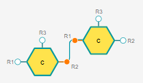
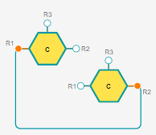
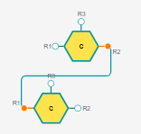
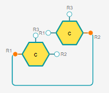

# Class: PolymerBondRenderer

## How Snake Bonds Algorithm Works

### Prerequisites:
1) Only attachment points ['R1', 'R2'] have snake bond mode;
2) Only Peptide and Chem monomers have snake bond mode;
3) If there is a second monomer, then Snake bond mode could be enabled only when 2 monomers are not on the same horizontal line which means the distance of their Y-axis model coordinate is more than 0.5.
4) There are still free attachment points for both monomers.
5) There is no more than 1 bond between the first and the second monomer.
6) Snake mode and Single Bond memu are enabled.

### Workig Flow

Events triggered from: `Bond.ts`

1. When mousedown a monomer, the snake bond will start to be created. 
Refer to `RenderersManager - addPolymerBond`
2. When mousemove, the Snake Bonds Algorithm will be constantly called to calculate the position of the snake bond and move it.  
Refer to `RenderersManager - movePolymerBond`
3. When mouseup a monomer, the snake bond creation will be finished. 
Refer to `RenderersManager - finishPolymerBondCreation`

### Algorithm for Drawing Snake Bonds:

It will first calculate the position of the second monomer relative to the first monomer, then draw the snake bond differently according to the result. 

1)   
If the second monomer is positioned to the **bottom-right** of the first one, it will verify if the current attachment point of the first monomer is `R1`, if not, then subsequent rules will be followed: 

* The snake bond will start with a horizontal line(with length of half of first monomer's width, plus LINE_FROM_MONOMER_LENGTH) originating from the first monomer's center;
* Then draw a left-bottom circular arc segment;
* Then draw a vertical line(with length of Y-axis distance between start and end position minus twice circular arc segment length);
* Then draw a top-right circular arc segment;
* Finally draw a horizontal line to connect the end position(with length of X-axis distance between start and end position, minus twice circular arc segment length, minus half of first monomer's width, minus LINE_FROM_MONOMER_LENGTH).    

  If this approach does not work, the start and end positions will be switched to recalculate and redraw the snake bond. This reverses the position calculation. For example, if the second monomer was initially at the bottom-right of the first one, after switching, the second monomer should be at the top-left of the first one. Consequently, the snake bond will be drawn differently. This aims to avoid a scanario in which both snake bonds connect both to the left side of a single monomer.

2)  
If the second monomer is positioned to the **top-left** of the first one, it will verify if the current attachment point of the first monomer is `R1`, if yes, the start and end positions will be switched in order to recalculate and redraw the snake bond. Otherwise, the following rules will apply: 

* The snake bond will start with a horizontal line(with length of half of first monomer's width, plus LINE_FROM_MONOMER_LENGTH) from the first monomer's center;
* Then draw a left-bottom circular arc segment;
* Then draw a vertical line(with length of first monomer's height);
* Then draw a top-left circular arc segment;
* Then draw a horizontal line(with length of X-axis distance between start and end position, plus twice LINE_FROM_MONOMER_LENGTH, plus first monomer's width);
* Then draw a right-up circular arc segment;
* Then draw a vertical line(with length of Y-axis distance between start and end position, minus first monomer's height);
* Then draw a bottom-right circular arc segment;
* Finally draw a horizontal line to connect the end position(with length of LINE_FROM_MONOMER_LENGTH, plus half of first monomer's width).

3)   
If the second monomer is to the **top-right** of the first one, it will also verify if the current attachment point of the first monomer is `R1`, if yes, the start and end positions will be switched in order to recalculate and redraw the snake bond. Otherwise, the following rules will apply: 

* The snake bond will start with a horizontal line(with length of half of first monomer's width, plus LINE_FROM_MONOMER_LENGTH) from the first monomer's center;
* Then draw a left-top circular arc segment;
* Then draw a vertical line(with length of Y-axis distance between start and end position, minus twice circular arc segment length, plus half of first monomer's height);
* Then draw a bottom-right circular arc segment;
* Finally draw a horizontal line to connect the end position(with length of X-axis distance between start and end position, minus twice circular arc segment length, minus half of first monomer's width and minus LINE_FROM_MONOMER_LENGTH).  

4)  
If the second monomer is to the **bottom-left** of the first one, it will also verify if the current attachment point of the first monomer is `R1`, if yes, the start and end positions will be switched in order to recalculate and redraw the snake bond. Otherwise, the following rules will apply: 

* The snake bond will start with a horizontal line(with length of half of first monomer's width, plus LINE_FROM_MONOMER_LENGTH) from the first monomer's center;
* Then draw a left-bottom circular arc segment;
* Then draw a vertical line(with length of VERTICAL_LINE_LENGTH);
* Then draw a top-left circular arc segment;
* Then draw a horizontal line(with length of X-axis distance between start and end position, plus twice LINE_FROM_MONOMER_LENGTH, plus first monomer's width);
* Then draw a right-bottom circular arc segment;
* Then draw a vertical line(with length of Y-axis distance between start and end position, minus 4 times circular arc segment length, minus VERTICAL_LINE_LENGTH);
* Then draw a top-right circular arc segment;
* Finally draw a horizontal line to connect the end position(with length of LINE_FROM_MONOMER_LENGTH, plus half of first monomer's width).

5)  
If the second monomer is to the **left** of the first one, it will also verify if the current attachment point of the first monomer is `R1`, if yes, the start and end positions will be switched in order to recalculate and redraw the snake bond. Otherwise, the following rules will apply: 

* The snake bond will start with a horizontal line(with length of half of first monomer's width, plus LINE_FROM_MONOMER_LENGTH) from the first monomer's center;
* Then draw a left-bottom circular arc segment;
* Then draw a vertical line(with length of Y-axis distance between start and end position, plus first monomer's height);
* Then draw a top-left circular arc segment;
* Then draw a horizontal line(with length of X-axis distance between start and end position, plus twice LINE_FROM_MONOMER_LENGTH, plus first monomer's width);
* Then draw a right-up circular arc segment;
* Then draw a vertical line(with length of first monomer's height);
* Then draw a bottom-right circular arc segment;
* Finally draw a horizontal line to connect the end position(with length of LINE_FROM_MONOMER_LENGTH, plus half of first monomer's width).

6) If none of the above approaches worked, a line will simply be drawn from the bond's starting position to its end.

