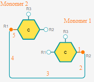
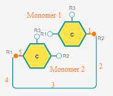

# Class: [PolymerBondRenderer](../PolymerBondRenderer/PolymerBondRenderer.ts)

## How Snake Bonds Algorithm Works

### Prerequisites:
1) Only attachment points ['R1', 'R2'] have snake bond mode;
2) Only Peptide and Chem monomers have snake bond mode;
3) If there is a second monomer, then Snake bond mode could be enabled only when 2 monomers are not on the same horizontal line which means the distance of their Y-axis model coordinate is more than 0.5.
4) There are still free attachment points for both monomers.
5) There is no more than 1 bond between the first and the second monomer.
6) Snake mode and Single Bond menu are enabled.

### Working Flow

Events triggered from: [Bond.ts](/packages/ketcher-core/src/application/editor/tools/Bond.ts)

1. When mousedown a monomer, the snake bond will start to be created. Refer [addPolymerBond](/packages/ketcher-core/src/application/render/renderers/RenderersManager.ts#L60)
2. When mousemove, the Snake Bonds Algorithm will be constantly called to calculate the position of the snake bond and move it.  
Refer to [movePolymerBond](/packages/ketcher-core/src/application/render/renderers/RenderersManager.ts#L67)
1. When mouseup a monomer, the snake bond creation will be finished. 
Refer to [finishPolymerBondCreation](/packages/ketcher-core/src/application/render/renderers/RenderersManager.ts#L92)

### Algorithm for Drawing Snake Bonds:

It will first calculate the position of the second monomer relative to the first monomer, then draw the snake bond differently according to the result. Possible scenarios:

1)   
If the second monomer is positioned to the **bottom-right** of the first one, it will verify if the current attachment point of the first monomer is `R1`:

    If yes: The start and end positions will be switched to recalculate and redraw a more natural snake bond. **For example, if the second monomer is to the bottom-right of the first one, but only the attachment point `R2` remains available, then the bond should connect first monomer's `R1` attachment point with the second monomer's `R2` attachment point. This is the exact scenario where the second monomer is positioned to the top-left of the first one if we switch the monomers.** This aims to avoid a scanario in which both snake bonds connect both to the left side of a single monomer.  

    If not: The bond will be drawn from the bond's starting position to its end, following the sequence depicted in the image.  

2)   
If the second monomer is positioned to the **top-left** of the first one, it will verify if the current attachment point of the first monomer is `R1`:

    If yes, the start and end positions will be switched in order to recalculate and redraw the snake bond. Otherwise, the bond will be drawn from the bond's starting position to its end, following the sequence depicted in the image. 

3)   
If the second monomer is to the **top-right** of the first one, it will also verify if the current attachment point of the first monomer is `R1`:

    If yes, the start and end positions will be switched in order to recalculate and redraw the snake bond. Otherwise, the bond will be drawn from the bond's starting position to its end, following the sequence depicted in the image. 

4)   
If the second monomer is to the **bottom-left** of the first one, it will also verify if the current attachment point of the first monomer is `R1`:

    If yes, the start and end positions will be switched in order to recalculate and redraw the snake bond. Otherwise, the bond will be drawn from the bond's starting position to its end, following the sequence depicted in the image. 

5)   
If the second monomer is to the **left** of the first one, it will also verify if the current attachment point of the first monomer is `R1`:

    If yes, the start and end positions will be switched in order to recalculate and redraw the snake bond. Otherwise, the bond will be drawn from the bond's starting position to its end, following the sequence depicted in the image. 

6) If none of the above approaches worked, a line will simply be drawn from the bond's starting position to its end.
